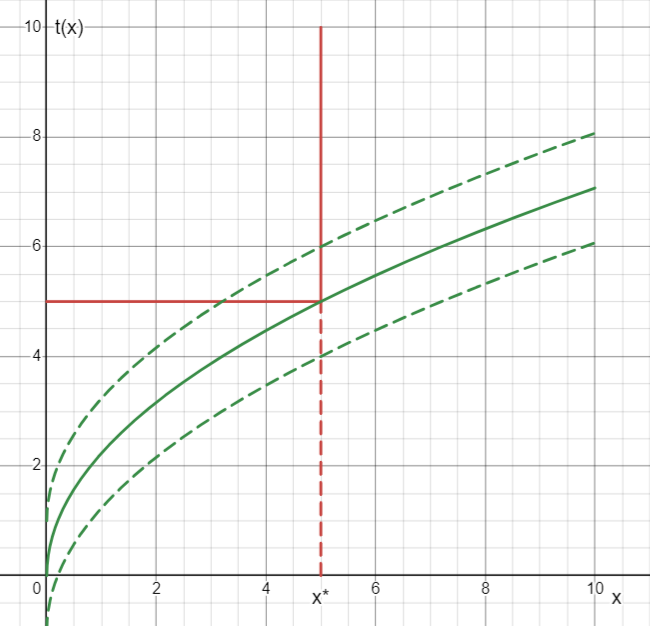

# Lecture 02, 10.09.2024

$$p=p(y), p'<0$$

$$y=f(L, K)$$ — production function of monopoly

$$\pi=\underbrace{p(f)f}_{TR}-wL-rK\to\max_{K,L>0}$$

$$FOC\colon\begin{cases}
    \frac{\partial (TR)}{\partial L}=w,\\
    \frac{\partial (TR)}{\partial K}=r
\end{cases}$$

Regulation based on the return rate of the capital

$$\boxed{\frac{TR-wL}{K}}\leq s,\quad s>0$$

$s$ — fair rate of return of the capital

```{prf:proposition}
$s > r$.
```

Rewrite this constraint in a different form:

$$TR-wL-sK\leq 0$$

$$\pi=\underbrace{TR-wL-sK}_{\leq 0}+\overbrace{(s-r)}^{>0}K$$

$$\mathcal{L}=TR-wL-rK-\lambda[TR-wL-sK]=(1-\lambda)[TR-wL-rK]+\lambda(s-r)K$$

If $\lambda \leq 0$, then

$$\lambda[TR-wL-rK]=0$$

$$0\leq\lambda<1$$

$$\begin{cases}
\frac{\partial \mathcal{L}}{\partial L}=(1-\lambda)\left[\frac{\partial(TR)}{\partial L}-w\right]=0\\
\frac{\partial \mathcal{L}}{\partial K}=\underbrace{(1-\lambda)}_{>0}\left[\frac{\partial(TR)}{\partial K} -r\right]+\underbrace{\lambda}_{>0}\overbrace{(s-r)}^{>0}=0
\end{cases}$$

$$\frac{\partial(TR)}{\partial K}-r=-\frac{\lambda(s-r)}{1-\lambda}<0$$

$$\boxed{\frac{\partial(TR)}{\partial K}<r}$$

## 

A non-discriminatory monopolist always choose a price schedule which is linear which means that she charges 

$$t(x)=px$$

where $x$ — is the quantity of the purchase.

---

All other prices schedules are non-linear.

**Two-part tariff.** You pay to enter and then there are more things you could pay for separately.
$$t(x)=\begin{cases}
A+px,x>0\\
0, x=0
\end{cases}$$

If price discrimination is allowed, it may be beneficial to the consumers and the monopoly itself. But first let's define some types of price discrimination.

## Price discrimination

If it's not forbidden by the regulating authority, price discrimination is beneficial for the monopoly itself.

In theoretical economics, 3 types of discrimination are considered.

```{prf:definition}
Pricing schedule is called linear if for some $p>0$ the payment charged by a monopolist is $t=py$, where $y$ represents an amount sold. All other prices schedules are non-linear.
```

### Perfect discrimination

According to Arthur Pigou, discrimination of the 1st kind means that a monopoly may charge different consumers different prices, and pricing is non-linear.

We operate within the restrictions that our economy is quasilinear.

This discrimination is called perfect discrimination since in order for it to happen, the monopoly has to have "perfect knowledge" of the market, including everyone's utility functions and the ability to distinguish the consumers from other another.

**Arbitrage** — buying some items for cheap somewhere and then reselling them at a higher price later. This concept ruins perfect price discrimination. This is very difficult to stop, which means if such price discrimination happens, then monopoly actually knows how to prevent this.

```{prf:example}
In the USA, there are state universities partially funded by the government. The tuition for them is different, if you have been living in the according county for 18+ months, then you would get a discount if you enrol in a local university.

Depending on your household's wealth, you may have a discount if you're under a certain threshold in terms of income per capita in the household. This is impossible to bypass because you would simply go to jail.  
```

## Discrimination Model

Let $i\in I$ and $U_i(x_i,z_i)=\nu_i(x_i)+z_i$, where $\nu'_i>0,\nu_i''<0$ and $v_i(0)=0$. Money endowments are $w_i>0$.

Let monopoly offer $x_i$ amount to the $i$th consumer and charge her $t_i$. The following inequality is called **participation constraint equality**.

$$\nu_i(x_i)-t_i\leq 0\quad \text{for}\ i\in I$$

If this inequality is strict, then the bargain will satisfiy the consumer, but even if $\nu_i(x_i)=t_i$, then the deal can still be reached.

Let $c(y)$ be the costs function with the properties $c'(y)>0,c''(y)>0$. 

## Maximization problem

Set the maximization problem 

$$\begin{cases}
    \pi=\sum_{i\in I}t_i-c(y)\to\max\\
    y=\sum_{i\in I}x_i\\
    \nu_i(x_i)\geq t_i,\quad x_i\geq 0
\end{cases}$$

If all the consumers agree to the deals, then 

$$\pi=\sum_i\nu_i(x_i)-c\left(\sum_i x_i\right)\xrightarrow{x_i\leq0}\max$$

This is exactly the welfare indicator maximization that as a solution has Pareto optimal 


$$\pi(x_1,\ldots,x_n)=\sum_{i=1}^nt_i-c\left(\sum x_i\right)$$

$$t_i=v_i(x_i)$$

due to participation constraint

$$\pi=\sum^n_{i=1}v_i(x_i)-c\left(\sum^n_{i=1}x_i\right)\to\max_{x_i\leq 0}$$

$$\begin{cases}
v_1'(x_1)=c\\
\vdots \\
v_n'(x_n)=c
\end{cases}$$

There is a two-part tariff and there is also pricing according to bundles/packages.

$$t_i=v_i(x_i^*), \quad \boxed{t^*=v(x^*)}$$

If the consumer meekly says that she wants more, the monopolist says take-it-or-leave-it:

$$t(x)=\begin{cases}
t^*, & 0<x\leq x^*\\
\infty, & x>x^*
\end{cases}$$

$$\begin{cases}
v(x)+z\to\max\\
t(x)+z\leq\omega\\
z=\omega-t(x)
\end{cases}\implies v(x^*)=t^*$$

$$v(x)+w-t(x)=c$$



## Two-part tariff

$$t(x)=\begin{cases}
A+px & x > 0\\
0 & x=0
\end{cases}$$

Let's find these parts. 
The entry payment and per-unit price $p$, and $x^*$ — the solution of the consumer problem:

$$\begin{cases}
\nu(x)+z\xrightarrow{x, z}\max\\
A+px+z\leq w\\
w,x,z\leq 0
\end{cases}$$

Then, $z=w-A-px$ and $\nu(x)+w-A-px\to_{x>0}\max\implies v'(x^*)=p$

---

$$A=v(x)-\underbrace{px}_{C}=CS=\int\limits^{x^*}_0(v'(x)-p)dx$$