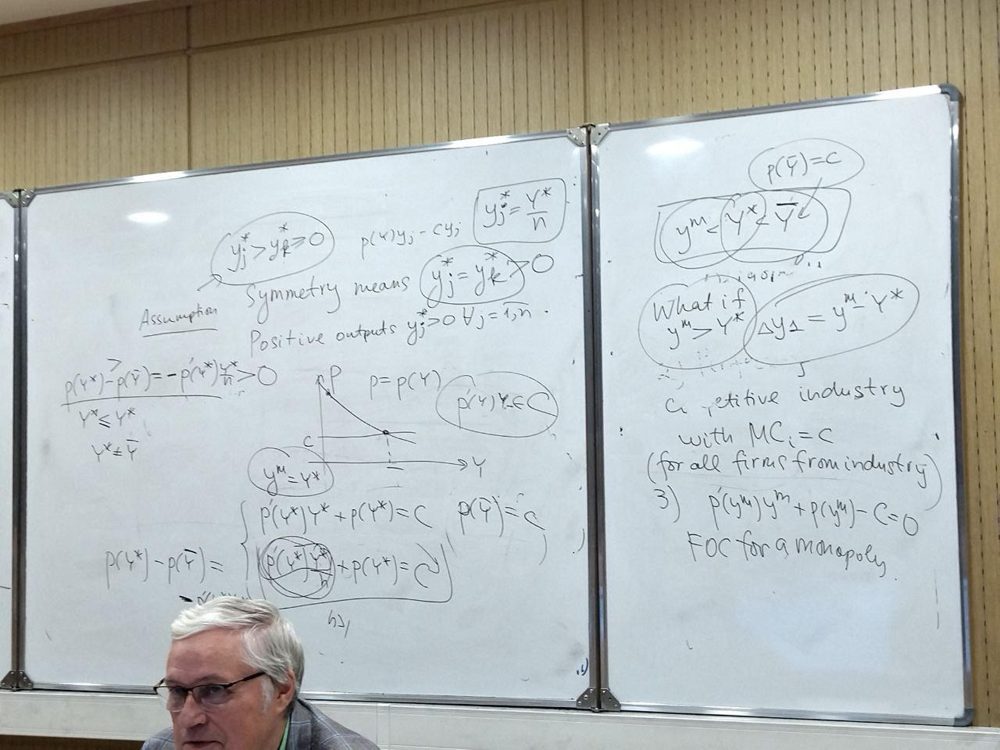

# Lecture 4, 24.09.2024, Game Theory

## Game Theory Basics

As we have seen from the previous chapter in the case of a linear citry model, in finding the optimal price a firm should take into account the price charged by competitor.

These interactions are studied in the Game Theory. Here we consider the basic notions of this theory. We need to learn the basis since in the forthcoming chapters on oligopoly we'll be considering strategies followed by firms.

We start at simultanious games. 

This is a game in which a single decision is made by each player and each player has no knowledge of other player decisions before the game.

Having said this, we do not exclude the expectations of decisions that may or may not be realized.

To describe such a game we need to specify the following:

1. The set of players indexed by $i\in I$;
2. a strategy set $S_i$ for each player;
3. payoffs for each player for any combination of strategies used by all players.

### Example (Prisoners' Dilemma)

There are two players $P_1$ and $P_2$ who choose actions $C$ (cooperate) or $D$ (defect).

Their payoffs are in the following table:

```{figure} ./image-8.png
:height: 200
:label: prisoner-dilemma
Payoffs for $P_1$ and $P_2$
```

What actions will the players choose?

Clearly, $(D, D)$ that provide less payoffs compared with $(C, C)$. We say that $(D, D)$ is Pareto inefficient (Parento optimality is used here in the same sense like in exchange theory).

When a game is described in a tabular form, we say that this is the **normal form** of a game.


### Nash equilibrium in pure strategies

```{prf:definition}
NE for 2 players is a pair of strategies $(\sigma_1^*,\sigma_2^*)$ such that

$$\pi_1(\sigma_1^*,\sigma_2^*)\leq\pi_1(\sigma_1,\sigma_2^*)$$

$$\forall\sigma_1\in S_1$$

$$\pi_2(\sigma_1^*,\sigma_2^*)\leq\pi_2(\sigma_1^*,\sigma_2)$$

$$\forall\sigma_2\in S_2$$

Here $\pi_1,\pi_2$ are payoffs of the players and $S_1,S_2$ are respective sets of strategies.
```

### Dominance solvable games

A strategy for player 1 $\sigma_1$ is strictly dominated by $\sigma_1'$ if 

$$\pi(\sigma_1',\sigma_2)>\pi(\sigma_1,\sigma_2)$$

$$\forall\sigma_2\in S_2$$

When inequality is non-strict, we call such dominance weak.

Strictly dominated strategies are not played.

#### Example 
Find NE of the matrix game

:::{figure} ./image-9.png
:height: 200
:label: matrix-game-example
Matrix game example.
:::

Solve by iterated elimination of the dominated strategies.

Unfortunately, when we have weakly dominated strategies in the payoff matrix, the solution may depend on the order in which strategies are eliminated. See below.

:::{figure} ./image-10.png
:height: 200
:label: matrix-game-example-2
Matrix game with weakly dominated strategies.
:::

1. **Order 1.** Eliminate $D$ for player 1. Then, eliminate $L$ and $R$ for player 2.
2. **Order 2.** Eliminate $R$ for player 2. Here we shall stop.

We've been considering only **pure strategies**. NE does not necessarily exists in pure strategies.

Consider a **matching pennies** game with the matrix

:::{figure} ./image-11.png
:height: 200
:label: matching-pennies-game
Matching pennies game matrix.
:::

Looking for NE in mixed strategies, we analyze expected payoffs.

```{prf:definition}
Let the set $S$ of strategies of a player consists of $S=\{s_a,s_b,s_c,\ldots\}$. Then a mixed strategy could be represented as a vector of probabilities $\sigma=(p(s_a),p(s_b),p(s_c),\ldots)$.
```

We consider 

$$\pi_i(\sigma_1,\sigma_2)=\sum_{s_1\in S_1}\sum{s_2\in S_2}p(s_1)q(s_2)\pi_i(s_1,s_2)$$

### The use of best responses

```{prf:definition}
A pair of strategies $(\sigma_1^*,\sigma_2^*)$ is a NE if 

$$\sigma_1^*\in\arg\max_{\sigma_1}\pi_1(\sigma_1,\sigma_2^*)$$

and

$$\sigma_2^*\in\arg\max_{\sigma_2}\pi_2(\sigma_1^*,\sigma_2)$$
```

#### Example

Solving for NE in pure and mixed strategies, consider the game

:::{figure} ./image-12.png
:height: 200
:label: swastika-game
:::

Strategy in the right column is better than the middle column so we may cross out the $M$ column. After omitting it, we get 

:::{figure} ./image-13.png
:height: 200
:label: swastika-game-M-removed
:::

Comparing $C$ and $D$ we get that $D$ is weakly dominated, so we may cross it out as well, getting the remaining matrix:

:::{figure} ./image-14.png
:height: 200
:label: swastika-game-M-D-removed
:::

Chances for the first player to choose the first and second columns respectively would be $p, 1-p$. Accordingly, for the second player and corresponding rows, $q, 1-q$.

When we calculate expected values, we get

$$\EE\pi_1=4pq+5p(1-q)+8(1-p)q+4(1-p)(1-q)$$

and 

$$\EE\pi_2=2pq+3p(1-q)+6(1-p)q+5(1-p)(1-q)$$

Here $p(U)=p,p(C)=1-p,p(L)=q,p(R)=1-q$.

By differentiating expected payoffs, we get

$$\frac{\partial\EE\pi_1}{\partial p}=1-5q$$

and

$$\frac{\partial\EE\pi_2}{\partial q}=1-2p$$

The best responses in $(p, q)$ plane will look like

:::{figure} ./image-15.png
:height: 300
:::

There are 2 NE in pure strategies, namely $(C, L)$ and $(U, R)$ and one NE in mixed strategies $(\frac{1}{2}U+\frac{1}{2}C,\frac{1}{5}L+\frac{4}{5}R)$.

Sequential games will be considered in the next chapter on oligopoly.

## Solving Game Theory Problems

### Problem 1

> We have solved the very same task as above once again somehow

Find all pure and mixed Nash equilibria in the bi-matrix game:

| | $d$ | $e$ | $f$ |
| :-: | :-: | :-: | :-: |
| $a$ | $(4,2)$ | $(2,2)$ | $(5,3)$ |
| $b$ | $(8,6)$ | $(3,3)$ | $(4,5)$ |
| $c$ | $(3,5)$ | $(7,4)$ | $(4,6)$ |

Strategy $e$ is dominated by strategy $f$ for the second player, so we may cross out $e$ because the second player would always prefer $e$ over $f$.

| | $d$ | $f$ |
| :-: | :-: | :-: |
| $a$ | $(4,2)$ | $(5,3)$ |
| $b$ | $(8,6)$ | $(4,5)$ |
| $c$ | $(3,5)$ | $(4,6)$ |

Strategy $a$ is strictly dominating over column $c$ (similarly, strategy $b$ is weakly dominating over $c$). This is also proven by expected values taking a precedence over ones in column $c$: $(4+8)/2=6>3$ and $(5+4)/2=4.5>4$. 

| | $d$ | $f$ |
| :-: | :-: | :-: |
| $a$ | $(4,2)$ | $(5,3)$ |
| $b$ | $(8,6)$ | $(4,5)$ |

Find the expected payoffs of the first and second players:

$$\EE\pi_1=4pq+5p(1-q)+8(1-p)q+4(1-p)(1-q)$$

$$\EE\pi_2=2pq+3p(1-q)+6(1-p)q+5(1-p)(1-q)$$

$$\begin{align*}\frac{\partial\EE\pi_1}{\partial p}=\ &4q+5(1-q)-8q-4(1-q)=\\&4q+5-5q-8q-4+4q=\\&-5q+1\end{align*}$$

$$\begin{align*}\frac{\partial\EE\pi_2}{\partial q}=\ &2p-3p+6-6p-5+5p=\\&-2p+1\end{align*}$$

### Problem 2

Three players play the following game. Simultaneously each of them chooses one possible bet: either $1\$$ or $2\$$. A player is declared a winner if her bet is unique and wins the amount of her bet. For example, if platers have chosen $1, 2$ and $1$, then their corresponding payoffs are $0, 2$ and $0$.

#### Subproblem A

Find all NE in pure strategies.

---

"Every player chooses $1$" is not NE (every player wants to deviate). "Every player chooses $2$" is not NE either for the same reason. Whereas there are only two options, which are NE, up to permutation: $(1, 1, 2)$ and $(2, 2, 1)$.

#### Subproblem B

Find symmetric NE in mixed strategies.

---

...

## Oligopoly

| | Choice of an output | Choice of a price |
| :-: | :-: | :-: |
| **Simultaneously** | Cournot | Bertrand |
| **Sequentially** | Stackelberg | Forheimer |

This chapter includes the classic Cournot model as well as sequential game model by Stackelberg and cooperative behaviour such as cartel and collusion between the firms.

### Cournot model

In this model the firms decide to produce simultaneously and their decisions are based on their expectations on the competitors' outputs.

Let's consider $n$ firms on the market whose costs functions are $c_i(y_i), j\in\overline{1,n}$. The inverse demand function is $p(Y)$, where $Y=\displaystyle\sum^n_{j=1}y_j$, $y_j$ is the output of the $j$-th firm. 

```{prf:definition}
The vector of outputs $(y_1^*,y_2^*,\ldots,y_n^*)$ is called Cournot equilibirium if $y_i^*$ solves the problem of $j-th$ profit maximization

$$\pi_j=p(y_j+\sum_{i\neq j}y_i^*)y_j-c_j(y_j)\xrightarrow[y_j\geq 0]{}\max$$

By default $\pi_j\leq 0$.
```

If we denote $Y_{-j}=\sum_{i\neq j}y_i$, then $y_j^*=R_j(Y^*_{-j})$, where $R_j$ is called the best response function of the $j$-th firm.

We assume that the profit maximization problem has a solution within some range of $Y$ values.

In the following propositions we assume that all firms are identical to $MC_j=c>0$ and the demand has the properties

1. $p'(Y)<0, Y>0$;
2. $p(0)>c$;
3. there exists $\tilde Y$ such that $p(\tilde Y) < c$

---

Then it's easy to prove the validity of 

```{prf:proposition}
Under $a, b, c$ assumptions

$$y_j^*=y_k^*>0,\forall j, k$$

and 

$$y^*_j=\frac{Y^*}{n}$$

where $Y^*$ is the aggregate supply of the oligopoly.
```

```{prf:proposition}
Under $a, b, c$ assumptions Cournot equilibirum exists, furthermore, if the revenue $p(Y)Y$ is concave, then the equilibirium is unique.
```

Assume that $y_j^*>y_k^*\leq0$
$$p(Y)y_j-cy_i$$

Symmetry means $y_j^*=y_k^*$.

Positive outputs $y_j^*>0,\forall j=\overline{1, b}$.

$$\text{FOC1}\colon p'(Y^*)y_j^*+p(Y^*)=c$$

$$\text{FOC2}\colon p'(Y^*)y^*_k+p(Y^*)\leq c$$

Now subtract two (in)equalities above:

$$\underbrace{p'(Y^*)}_{<0}\underbrace{[y_k^*-y_k^*]}_{\geq 0}\leq 0$$

Is it possible for $Y^*=0$?

In this case we would get

$$\cancel{p'(Y^*)y^*_k}+p(0)\leq c$$
$$p(0)\leq c$$

which isn't possible because all the firms in our model should produce at least something.

$$\boxed{y_j^*=\frac{Y^*}{n}}$$

$$\pi=p'(T^*)\frac{Y^*}{n}+\underbrace{p(Y^*)}_{>0}-c=0$$

If such values that $P(\tilde Y)<c$ exist, then we could get negative values.

In the next proposition we compare $Y^*$ with the equilibrium output of a monopoly $y^m$ that has $MC=c$, and the equilibrium output $\bar Y$ of a perfectly competitive industry consisting of identical firms with $MC_i=c$, then this output would satisfy $p(\bar Y)=c$.

```{prf:proposition} 
Under $a, b, c$ assumptions $y^m<Y^*<\bar Y
```

$$\boxed{y^m<Y^*<\bar Y}, p(\bar Y)=c$$

1. Oligopoly with $Y^*>0$ output
2. Perfectly competitive industry with $MC_i=c$ (for all firms from industry)
3. $p'(y^m)y^m+p(y^m)-c=0$ FOC for a monopoly.

$$\begin{cases}
p(\bar Y)=c
\end{cases}$$

> I TRIED BUT I HAVE NO IDEA WHAT'S GOING ON ANYMORE, I do hope we won't lose much if there aren't extensive proofs of the prepositions.



---

Now let $n=2$ (duopoly).

Let's draw in $(y_1, y_2)$ plane the collections of the isoprofit curves for both firm 1 and firm 2.

```{figure} ./image-17.png
:height: 300
```

Here $(y_1^*, y_2^*)$ is Cournot equilibirium. The tangent lines drawn to them through $(y_1^*,y_2^*)$ are parallel to the axes.

The above propositions can be extended to the case when $MC_j$ are all the same but not constant, i.e.

$$c_j(y)=c_k(y)\in C^1$$

Under assumptions $p'(Y)<0, p(0)>C'(0)$ all preceding propositions are valid. But as can be shown by exmaple if firms differ in their costs, equilibrium is not necessarily symmetric and positive.

For instance, if 

$$p(Y)=4-4Y, c_1(y_1)=2y_1^2, c_2(y_2)=2y_2^2+3y_2$$

then

$$y^*=\frac{1}{3},\quad y^*_2=0$$

If we add some extra assumptions such as $c_j(y)=c(y)\in C^1$ and $c_j$ is convex, $p(Y)Y$ is concave, then 

$$\lim_{n\to\infty}Y^*_n=\bar Y$$

Let $p(Y)=a-bY,MC_j=c>0,c<a$, then

$$Y_n^*=\frac{n}{n+1}\cdot\frac{a-c}{b}$$

Equilibrium price is 

$$p^*=c+\frac{a-c}{n}\xrightarrow[n\to\infty]{}$$

and

$$\lim_{n\to\infty}Y^*_n=\frac{a-c}{b}$$

### Cournot equilibrium and welfare

In symmetric case $y_j^*=\frac{Y^*}{n}$ where $Y^*$ satisfies FOC:

$$p'(Y^*)\frac{Y^*}{n}+p(Y^*)-c'\left(\frac{Y^*}{n}\right)=0$$

We have learned from quasilinear economy that all consumers can be represented by one agent whose utility is $\nu(x)+z$. Demand generated by this agent is $p(Y)=\nu'(Y)$.

Let's calculate derivative of welfare indicator $W(Y)$ at Cournot equilibirum $Y^*$.

Given

$$W(Y)=\nu(Y)-nc\left(\frac{Y}{n}\right)$$

$$W'(Y)=\nu'(Y)-c'\left(\frac{Y}{n}\right)$$

Then at $Y=Y^*$, using FOR, we get

$$W'(Y^*)=-p(Y^*)\frac{Y^*}{n}>0$$

That shows that $Y^*$ is less than optimal.

The entry fee regulates the number of firms in oligopoly. 

Let in symmetric case 

$$\pi_j(y_j)=\tilde\pi_j(y_j)+f$$

where $\tilde\pi_j(0)=0$, and $f$ is the entry fee.

The number of firms should satisfy

$$\tilde\pi_n\geq f\geq\tilde\pi_{n+1}$$

This $n$ value is unique since $\tilde\pi_n$ goes down as $n$ goes up.

Then it can be shown that $\lim_{f\to0}n=\infty$.

## Stackelberg's model

This is a two stage game.

Firm 1 is the leader that makes the first move by choosing the output $y_1$. Then the follower knowing $y_1$ makes its move by producing $y_2$.

We say that the leader has the first move advantage. The follower would produce in the second stage. This advantage is based on information how the follower would respond to $y_1$. Thus the leader has full information, understanding the best response of the follower and may use this information to their advantage.

Let the costs be $c_1(y)$ and $c_2(y)$, respectively.

```{prf:definition}
The output vector $(y_1^S,y_2^S)$ is called Stackelberg's equilibrium, if the best response function $R_2(y_1)$ follower exists for $y_1\geq 0$ and $y_1^S$ is the solution of the maximization problem

$$\pi_1=p(y_1+R_2(y_1))y_1-c_1(y_1)\xrightarrow[y_1\geq 0]{}\max$$

and

$$y_2^S=R_2(y_1^S)$$
```

In the figure we may find $(y_1^s, y_2^S)$ by lowering down one of the isoprofit curves of the leader until it touches the best response curve $y_2=R_2(y_1)$ at $(y_1^S, y_2^S)$.

```{figure} ./image-18.png
:height: 300
```

If we were to join the peaks of the leader's isoprofit with the $R_1(y_2)$ curve, then we can find $(y_1^*,y_2^*)$, i. e. Cournot equilibrium that differs from $(y_1^S, y_2^S)$ 

```{figure} ./image-19.png
:height: 300
```

```{prf:proposition}
Let $p(Y)$ be a decreasing funciton and $c_1(y_1)$, $c_2(y_2)$ are the costs of a leader and a follower, respectively. Then if $(y_1^C, y_2^C)$ is Cournot equilibrium and $(y_1^S, y_2^S)$ is Stackelberg's equilibrium, then $y_2^C\geq y_2^S$.
```

$$p(y_1^S+y_2^S)\cancel{y_1^S}-\cancel{c_1(y_1^S)}\geq p(y_1^C+y_2^C)y_1^C-c_1(y_1^C)\\\geq p(y_1^s+y_2^C)\cancel{y_1^S}-\cancel{c_1(y_1^S)}$$

$$\cancel{y_1^S}+y_2^S\leq \cancel{y_1^S}+y_2^C$$

```{seealso}

```

```{prf:corollary}
As for the comparison between $y_1^S$ and $y_1^C$, it depends on the monotonicity of $R_2(y_1)$. Suppose $R_2(y_1)$ is decreasing, then $y_1^S\geq y_1^C$.

If $R_2(y_1)$ is increasing, then the sign of the inequality is opposite.

For the most part, $R_2$ is decreasing.
```

It's interesting that even if $R'_2(y_1)<0$, under the following conditions, we can show that $R_2'(y_1)>-1$.

These conditions are 

1. $p'(y)<0$;
2. $c_2'(y_2)\geq 0, c_2''(y_2)\geq 0$.

From $R_2'(y_1)>-1$ we get $(y_1+R_2(y_1))' > 0$, meaning that $y_1^S+y_2^S>y_1^C+y_2^C$.

```{seealso}
In comparison with other oligopoly models,

* The aggregate Stackelberg output is greater than the aggregate Cournot output.
* The Stackelberg price is lower than the Cournot price.
* The Stackelberg consumer surplus is greater than the Cournot consumer surplus.
* The aggregate Stackelberg output is greater than pure monopoly but less than the perfectly competitive output.
* The Stackelberg price is lower than the pure monopoly but greater than the perfectly competitive price.
```

For instance if $p(y)=a-by, MC_1=MC_2=c<a$, then 

$$R_2(y_1)=\frac{a-c}{2b}-\frac{1}{2}y_1,\quad y_1^S=\frac{a-c}{2b},\quad y_2^S=\frac{a-c}{4b}$$

and

$$y_1^S+y_2^S=\frac{3}{4}\cdot\frac{a-c}{b}>\frac{2}{3}\cdot\frac{a-c}{b}=y_1^C+y_2^C$$

## Cooperative behaviour of firms

To improve profitability, the firms have to reduce their outputs. It is clear from the figure below where the arrow shows the direction of reduciton of the outputs where the profits go up.

:::{figure} ./image-20.png
:height: 300
:::

Similarly, let's suppose we have Cournot's duopoly.

Then their profits are 

$$\pi_1=p(y_1+y_2)y_1-c_1(y_1)$$

and

$$\pi_2=p(y_1+y_2)y_2-c_2(y_2)$$

Let $dy_1<0,dy_2=0$ using total differentials we get at $(y_1^C,y_2^C)$

$$d\pi_1=p(y_1+y_2)dy_1+y_1p'(y_1+y_2)(dy_1+dy_2)-c'_1(y_1)dy_1\biggm|_{dy_2=0}=\\
dy_1(p(y_1+y_2)+p'(y_1+y_2)y_2-c_1'(y_1))=0$$

at $(y_1^C,y_2^C)$ and at the same time

$$d\pi_2=y_2p'(y_1+y_2)dy_1>0$$

If $n\geq 3$ and at least 2 of them decide to cut the outputs, then we would have an improvement for all firms.