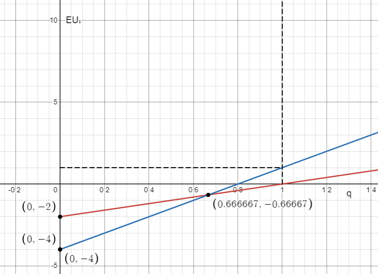

# Seminar 3, 20.09.2024

## Problem 1

> All these games are called **discrete games** because all of them have discrete strategies.


### Chicken out (Volleyball Game)

| | $L$ | $G$ |
| - | - | - |
| $L$ | $(0, 0)$ | $(-2, 1)$ |
| $G$ | $(1, -2)$ | $(-4, -4)$ |


Let's imagine the 2nd player chooses strategy $L$. Then the 1st player plays $G$ and gets $1$. If the 2nd player chooses strategy $G$, then the 1st player chooses strategy $L$.

If the 1st player's strategy is fixed, then if she chooses to play $L$, then the 2nd player would play $G$. Similarly, if the 1st player chooses to play $G$, then the 2nd player chooses to play $L$.

These states which are agreed upon by both players are called **Nash equilibria**.

$$\text{NE: (L, G), (G, L)}$$

in pure strategies.

### Controller vs Free Rider

| | $I$ | $II$ |
| - | - | - |
| $I$ | $(1, -1)$ | $(-1, 1) $|
| $II$ | $(-1, 1)$ | $(1, -1)$ |

Controller chooses the strategy that the free rider has chosen, whereas the free rider tries to choose the strategy that the controller has **not** chosen; therefore, we have no Nash equilibria in pure strategies.

### Mixed strategies

Mixed strategies are about randomness and making decisions. (You can toss a coin or try to pick a random number.)

Let's assign probabilities to each chosen strategy in the first problem.

| | $L, \ P(L)=q$ | $G,\ P(G)=1-q$ |
| - | - | - |
| $L,\ P(L)=p$ | $(0, 0)$ | $(-2, 1)$ |
| $G,\ P(G)=1-p$ | $(1, -2)$ | $(-4, -4)$ |

Then, our goal is to maximize our utility by choosing the most optimal probabilistic split when to choose what strategy.

$$\underbrace{⬛⬛⬛}_{P(L),\ 30\%}\underbrace{⬜⬜⬜⬜⬜⬜⬜}_{P(G),\ 70\%}$$

#### Solution 1

We would have the expected utility for the first player as:

$$\mathbb{E}U_1=p\cdot q\cdot0+(-2)\cdot p\cdot(1-q)+1\cdot(1-p)\cdot q+(-4)\cdot(1-p)\cdot(1-q)\to\max_{p\in[0,1]}$$

* $p(q)$ would be our best response.

#### Solution 2

However, we could solve this problem differently. Let's calculate the following:

$$\mathbb{E}U_1(L)=0\cdot q-2(1-q)=2q-2$$
$$\mathbb{E}U_1(G)=1\cdot q-4(1-q)=5q-5$$



$$p(q)=\begin{cases}
1 & q<\frac{2}{3}\\
\in [0, 1] & q=\frac{2}{3}\\
0 & q>\frac{2}{3}
\end{cases}$$

$$q(p)=\begin{cases}
1 & p<\frac{2}{3}\\
\in [0, 1] & p=\frac{2}{3}\\
0 & p>\frac{2}{3}
\end{cases}$$

For the second game, the Nash equilibrium would be 

$$\left(\frac{1}{2}I+\frac{1}{2}II,\frac{1}{2}I+\frac{1}{2}II\right)$$

```{warning} 
In the table below, $AA$ means that we take route $A$ if the first player goes $A$ and we take route $A$ if the first player goes $B$. These are the strategies that the second player says she would do. 
```

| | $\overset{LG}{LL}$ | $\overset{LG}{LG}$ | $\overset{LG}{GL}$ | $\overset{LG}{GG}$
| - | - | - | - | - |
| $L$ | $(0, 0)$ | $(\underline0, 0)$ | $(-2, \underline{\underline{1}})$ | $(-\underline{2}, \underline{\underline{1}})$ |
| $G$ | $(\underline1, -\underline{\underline{2}})$ | $(-4, -4)$ | $(\underline1, -\underline{\underline{2}})$ | $(-4, -4)$ 

```{warning}
Double line denotes the highest outcome(s) in a row, whereas single line denotes the highest outcome in a column.
```

```{definition}
**SPNE — subgame perfect Nash equilibria**. This kind of equilibria means that no player would want to deviate whatsoever. SPNE is always a Nash equlibiria by itself.
```